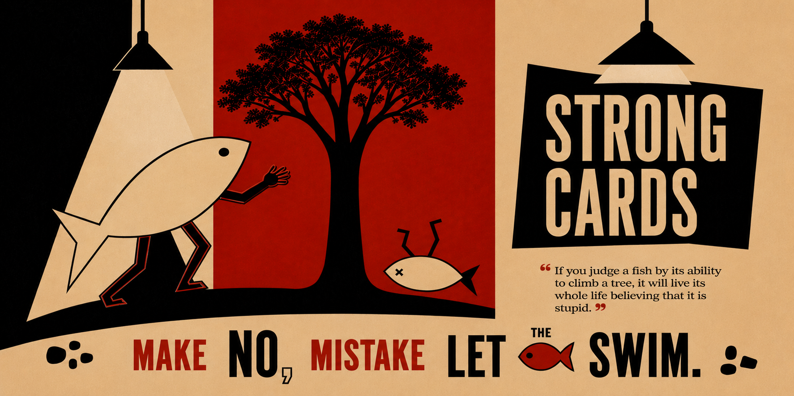

# strong-cards

The durable, versioned, global home for the **Strong Card** methodology: how a bounded
unit of work is specified, dispatched to a coding model, independently verified, judged
on failure, and merged.

This repo is the source of truth. `~/.claude/CLAUDE.md`'s "Grandmaster Doctrine" section
should eventually shrink to a pointer here rather than duplicating the text — one owner,
one copy. Until that cut is made, `RULES.md` §1 holds the doctrine verbatim so the two
never silently diverge.

## Why a repo and not a memory note

Two rules in `RULES.md` are permanent and were written in blood on 2026-08-10: a dispatched
worker escaped its declared touch list and deleted a shipped, tested production module,
and there was no git history to revert to. Memory notes get compacted, paraphrased, and
lost. A git-tracked ruleset with a commit history does not. Every rule here traces to a
real incident or a real observation in `runs/` — nothing is invented for completeness.

## Index

| File | What it is |
|---|---|
| `RULES.md` | The consolidated global ruleset. Doctrine (§1) + mandatory operational rules (§2–§8). Read this before dispatching anything. |
| `CARD-TEMPLATE.md` | The reusable Strong Card template — the exact card shape that worked across 20+ cards. Copy it per card. |
| `JUDGE-PROTOCOL.md` | The two judge roles: per-card fail/slow judge (Sonnet, low effort, runs every time) and post-run retrospective judge (Opus, once per run). |
| `hooks/README.md` | What a Claude Code hook can and cannot enforce here — read before trusting the hooks. |
| `hooks/settings.hooks.json` | Drop-in hooks block to merge into a project's `.claude/settings.json`. |
| `hooks/*.sh` | The hook scripts themselves. |
| `runs/<run-id>/RETROSPECTIVE.md` | One retrospective per completed multi-card run. The evidence behind the rules. |

## Quick start for a new project

1. `git init` the tree and commit a baseline **before any dispatch**. No exceptions (RULES §2).
2. Copy `hooks/` into the project's `.claude/hooks/`, merge `hooks/settings.hooks.json` into
   `.claude/settings.json`.
3. Write cards from `CARD-TEMPLATE.md` into `.audit-scratch/cards/`.
4. Keep a live tracker (one row per card: status, independent verification, notes) —
   it is the input to the post-run retrospective judge.
5. Dispatch per RULES §3 (worktree-isolated), verify per RULES §5, judge per `JUDGE-PROTOCOL.md`.

## Scope note

This repo governs *methodology*. Model routing, local-server recipes, and machine-specific
setup stay in `~/.claude/CLAUDE.md` and the earlier experiments/proof archive. The one
routing rule restated here is the hard one: never call `ANTHROPIC_API_KEY` /
`OPENAI_API_KEY` directly (RULES §9).
